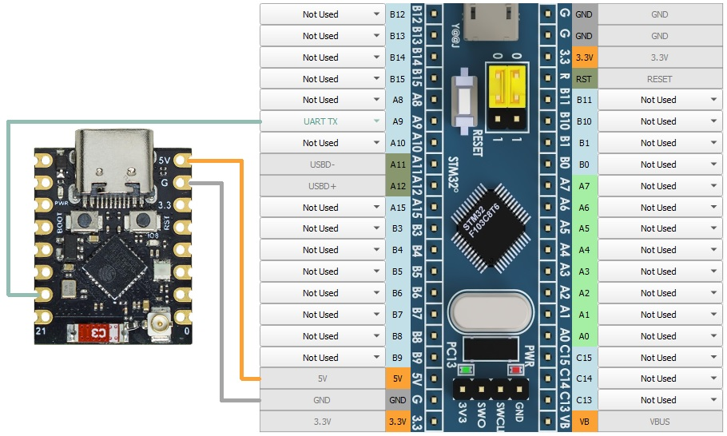

[Start page](../README.md) | [Previous level](../README.md)

The FreeJoy controller can be connected to an ESP32-C3 (or other ESP32, if you edit the sketch) for use as a Bluetooth joystick. Configuration is not possible, it can only be used as a pre-built joystick.

Connect pin A9 of the UART TX to pin 20 on the ESP32-C3 board and upload [this sketch](https://github.com/FreeJoy-Team/FreeJoyBluetooth);

[Start page](../README.md) | [Previous level](../README.md)