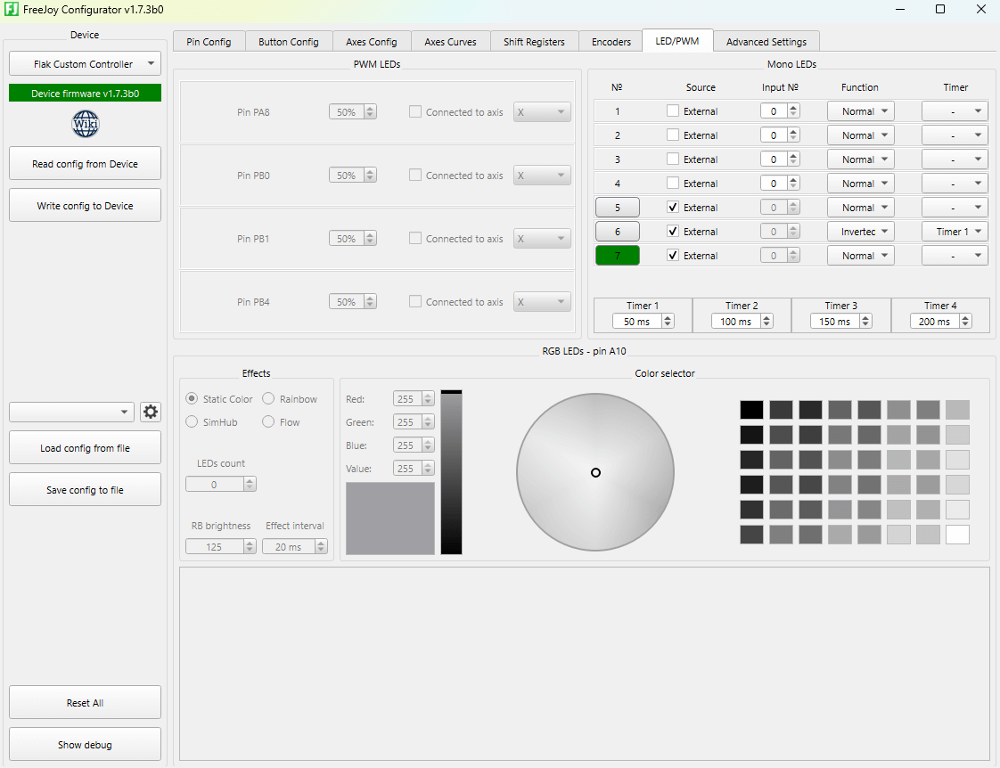

[Start page](../README.md) | [Previous level](LED-connection.md)

## External controlled LEDs

FreeJoy supports controlling up to 24 LEDs from host software using HID reports. This feature allows third-party software (like games or telemetry tools) to control LEDs on your device.

### Configuration

To enable external control for a specific LED:
1. Go to the **LEDs** tab in FreeJoy Configurator.
2. For the desired LED, check the **External** checkbox.



When the **External** checkbox is checked, the LED will be controlled only by host software.

### Protocol

LEDs are controlled by sending a HID Output Report to the second HID device (Usage Page: `0xFF00`, Interface: `1`).

| Byte | Value | Description |
| --- | --- | --- |
| 0 | 6 | Report ID |
| 1-4 | Bitmask | LED states (1 bit per LED, 4 bytes, little-endian) |

The bitmask allows you to control all 24 LEDs simultaneously. Bit 0 of the bitmask corresponds to LED 1, bit 1 to LED 2, and so on.

### Python Example

You can use the `hidapi` library to control LEDs from Python:

```python
import hid

# FreeJoy USB VID/PID
VID = 0x0483
PID = 0x5757

def set_freejoy_leds(led_mask):
    # Find the correct interface (Interface 1 for LEDs)
    target_path = None
    for device in hid.enumerate(VID, PID):
        if device['interface_number'] == 1:
            target_path = device['path']
            break

    if not target_path:
        print("FreeJoy interface 1 not found")
        return

    try:
        device = hid.device()
        device.open_path(target_path)

        # Report ID 6 + 4 bytes of bitmask (little-endian)
        report = [0x06] + list(led_mask.to_bytes(4, 'little'))
        device.write(report)
        device.close()
    except Exception as e:
        print(f"Error: {e}")

# Example: Turn on LEDs 1 and 3 (bitmask 0x05)
set_freejoy_leds(0x00000005)
```

[Start page](../README.md) | [Previous level](LED-connection.md)
