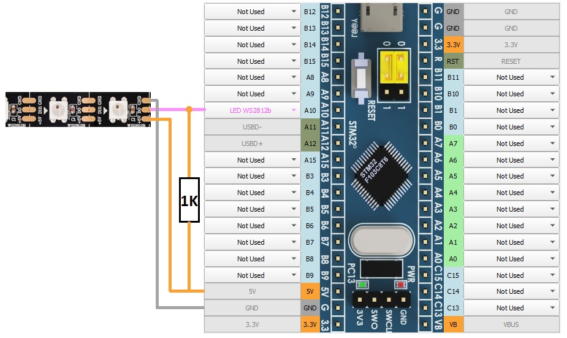
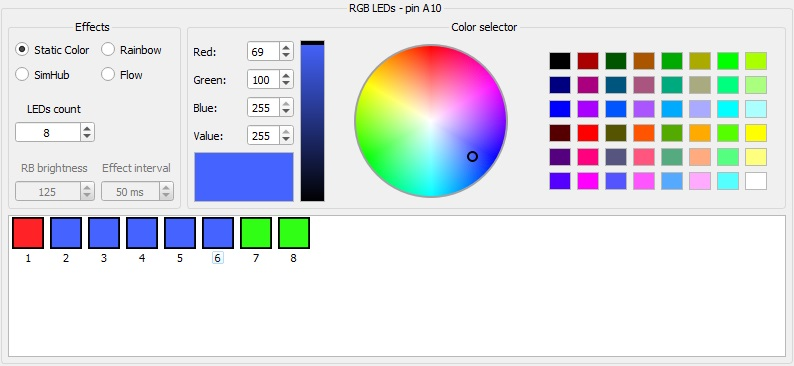
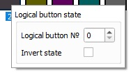

[На стартовую страницу](../README.md) | [Предыдущий раздел](Подключение-светодиодов.md)
## Подключение ARGB светодиодов WS2812, PL9823:

Адресные светодиоды подключаются к пину A10 через подтяжку резистором 1К к 5в.

## Настройки:

Во вкладке LED/PWM находятся настройки светодиодов. подключите свтодиоды, как на рисунке выше, выберите количество в LEDs count и нужный эффект. Светодиоды в списке можно выделять мышью и настраивать сразу несколько.

Эффекты:
1. Статический цвет - светодиод горит одним заданным цветом.
2. Радуга - светодиоды переливаются цветами радуги с настраиваемым интервалом и яркостью.
3. Поток - светодиоды передают свой цвет следующему светодиоду с настраиваемым интервалом.
4. SimHub - управление светодиодами через приложение [SimHub](Подключение-к-SimHub.md).

## Кнопки:

На светодиод можно кликнуть правой кнопкой мыши и выбрать какой логической кнопкой он будет включаться или выключаться.

[На стартовую страницу](../README.md) | [Предыдущий раздел](Подключение-светодиодов.md)

