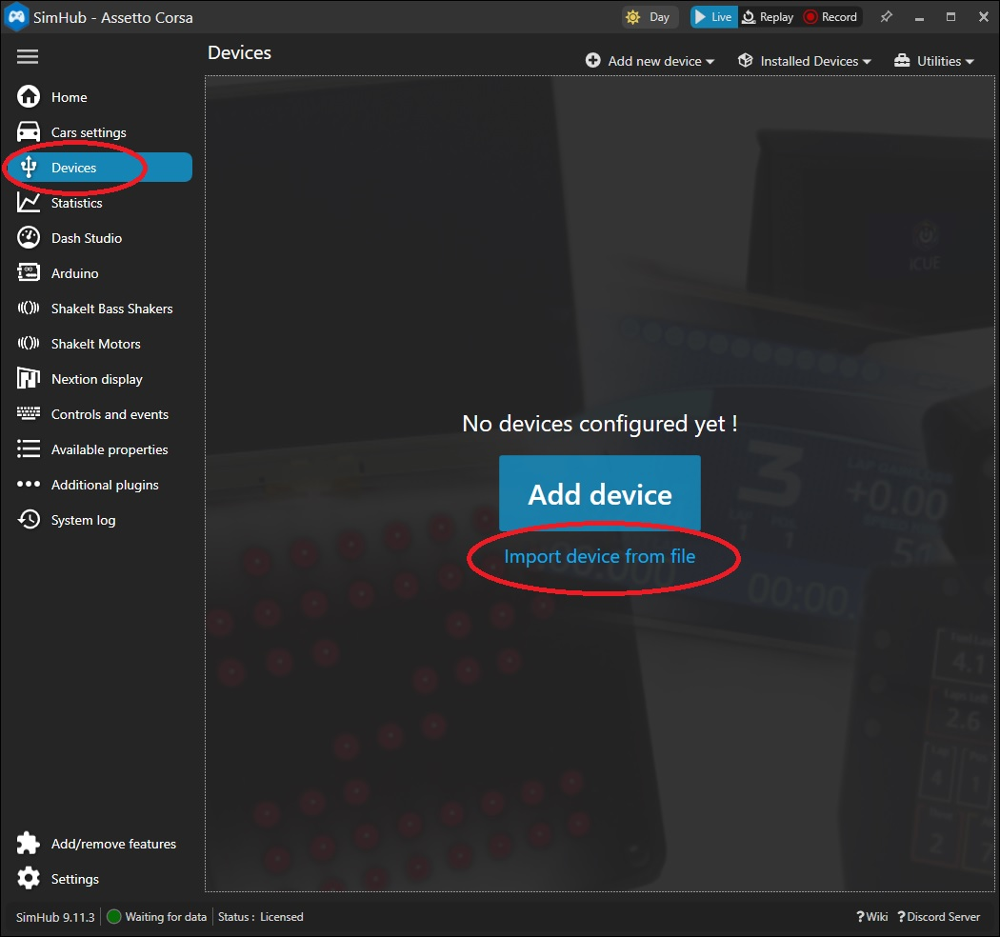

[На стартовую страницу](../README.md) | [Предыдущий раздел](Подключение-светодиодов.md)
## Подключение FreeJoy к SimHub:

В SimHub слева выберите "Devices", нажмите на "Import device from file" и выберите файл [FreeJoy.shdevice](../3rd-party/FreeJoy.shdevice). Во вкладке "USB PID/VID configuration" настройте VID/PID, как в конфигураторе FreeJoy и количество светодиодов.
Как настроить SimHub смотрите в его [wiki](https://github.com/SHWotever/SimHub/wiki/LED-Editor-guide)

[На стартовую страницу](../README.md) | [Предыдущий раздел](Подключение-светодиодов.md)

